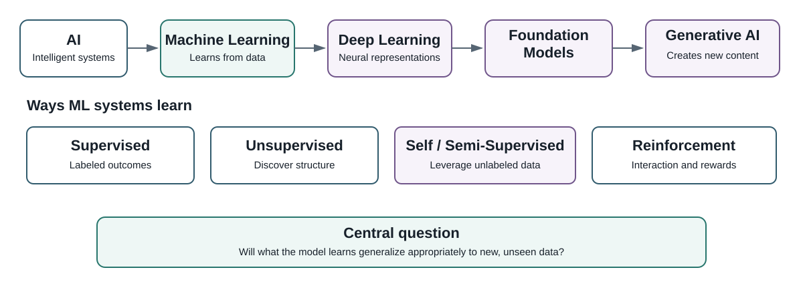

# Machine Learning in the Age of Data and AI

## Learning Objectives

By the end of this chapter, you should be able to:

- define machine learning in terms of data, models, loss, and generalization;
- distinguish AI, machine learning, deep learning, foundation models, and generative AI;
- distinguish supervised, unsupervised, semi-supervised, self-supervised, and reinforcement learning;
- identify observations, features, targets, predictions, parameters, and hyperparameters;
- explain why performance on unseen data is central to machine learning;
- distinguish prediction, explanation, inference, and causation;
- formulate problems using health, education, and benchmark-data tracks;
- distinguish model fitting from a potential research contribution.

## Why This Matters

Machine learning supports predictive systems, scientific discovery, decision support, and modern AI. The ability to call `fit()` is not the same as understanding machine learning.

::: {.callout-important icon=false}
## Central Question
**How do we build models that learn from data—and how do we know they will work appropriately on data they have never seen?**
:::

## A Conceptual Map of Modern Machine Learning

{#fig-ai-ml-map fig-cap="A conceptual map of AI, machine learning, and modern learning paradigms."}

**Artificial intelligence (AI)** is the broadest concept here. **Machine learning (ML)** is a major approach to AI in which models learn patterns from data [@mitchell1997]. **Deep learning** uses multilayer neural networks to learn representations [@goodfellow2016]. **Foundation models** are trained at scale on broad data and adapted to downstream tasks [@bommasani2021opportunities]. **Generative AI** creates new content such as text, images, audio, video, or code.

Modern generative systems do not make classical machine learning obsolete. Regression, trees, ensembles, clustering, and related techniques remain central to structured problems in health, education, finance, operations, and science.

## What Does It Mean for a Machine to Learn?

We say that a machine learns, but the word deserves examination. A machine learning system does not necessarily understand a phenomenon in the way a human researcher understands it. It identifies patterns in representations of observations and uses those patterns to perform a task.

This distinction raises an important question: When a model predicts accurately, what has it actually learned?

A model may discover a stable relationship, exploit a proxy variable, reproduce a historical pattern, or capitalize on an artifact of data collection. Predictive success alone cannot tell us which explanation is true.

This is why machine learning is concerned with evidence and not just computation. We must ask what the data represent, what the model has access to, where the pattern came from, whether it generalizes, and what conclusions the evidence permits.

A useful habit for the data scientist is therefore:

Do not ask only, "Does the model work?" Ask, "What does its success allow me to know?"

Suppose we observe

$$
\mathcal{D}=\{(x_i,y_i)\}_{i=1}^{n}.
$$

A supervised model estimates

$$
f_{\theta}:\mathcal{X}\rightarrow\mathcal{Y},
$$

and predicts

$$
\hat y=f_{\theta}(x).
$$

Many algorithms learn parameters by minimizing a loss:

$$
\hat{\theta}=\arg\min_{\theta}\frac{1}{n}\sum_{i=1}^{n}L(y_i,f_{\theta}(x_i)).
$$

::: {.callout-note icon=false}
## Read the Equation Before Solving It
For now, read the pattern conceptually:

**data → model → prediction → error → learning**

Chapter 3 develops the mathematics.
:::

## The Vocabulary of an ML Problem

An **observation** is the unit represented by a row of modeling data. A **feature** is an input variable available to the model. A **target** is the outcome a supervised model attempts to predict. A **prediction**, $\hat y$, is the model's estimate.

A **parameter** is learned from training data. A **hyperparameter** controls an aspect of the learning process and is generally selected through validation.

## Ways Machine Learning Systems Learn

### Supervised Learning
Uses labeled outcomes. Major tasks are **regression** and **classification**.

### Unsupervised Learning
Searches for structure without a predefined target. Common tasks include clustering, dimensionality reduction, and anomaly detection.

### Semi-Supervised Learning
Combines a smaller labeled dataset with a larger collection of unlabeled observations.

### Self-Supervised Learning
Constructs learning signals from the data themselves and is important in modern representation learning.

### Reinforcement Learning
An agent interacts with an environment, takes actions, receives feedback, and learns a policy intended to maximize cumulative reward [@suttonBarto2018].


## Machine Learning Workloads: Where Computer Vision Fits

Learning paradigms describe **how a system learns**. Workloads describe **what kind of problem or data the system works with**. These are different dimensions.

For example, **computer vision** is a major machine-learning workload concerned with extracting useful information from images and video [@szeliski2022]. A vision system may use supervised, self-supervised, semi-supervised, or other learning paradigms.

Common computer-vision tasks include:

- **image classification** — assign a label to an image;
- **object detection** — identify and locate objects;
- **image segmentation** — assign labels to pixels or regions;
- **image retrieval and similarity** — find visually related images;
- **visual anomaly detection** — identify unusual visual patterns;
- **image generation and transformation** — create or modify visual content.

Other important ML workloads include natural-language processing, forecasting, recommendation, anomaly detection, ranking, and multimodal learning.

The distinction matters:

$$
\boxed{
\text{Learning Paradigm}
\neq
\text{Workload}
}
$$

A computer-vision application is not automatically "deep learning," although modern vision systems often use neural networks. Classical ML can also operate on image features, and later chapters will show how representation learning changes what can be learned from visual data.

::: {.callout-tip icon=false}
## Computer Vision Learning Thread

Computer vision will appear as a recurring learning experience in this book. We begin with images as numerical arrays, then revisit visual representation, classification, neural networks, evaluation, responsible use, and reproducibility.

The goal is not merely to run a vision model. It is to understand how an image becomes data, how representations affect learning, and what evidence is required before a visual prediction should be trusted.
:::

## Why Generalization Matters

A model can memorize training observations and perform poorly on new data. This is **overfitting**.

We distinguish **training data**, used to estimate parameters; **validation data**, used for model selection and tuning; and **test data**, protected for final evaluation.

### A First Generalization Experiment

This experiment fits decision trees of increasing complexity to a nonlinear classification problem.

```{python}
#| label: fig-generalization
#| fig-cap: "Training and test accuracy as decision-tree complexity increases."
#| warning: false
#| message: false

import matplotlib.pyplot as plt
from sklearn.datasets import make_moons
from sklearn.model_selection import train_test_split
from sklearn.tree import DecisionTreeClassifier

X, y = make_moons(n_samples=800, noise=0.30, random_state=42)

X_train, X_test, y_train, y_test = train_test_split(
    X, y, test_size=0.30, random_state=42, stratify=y
)

depths = range(1, 21)
train_scores, test_scores = [], []

for depth in depths:
    model = DecisionTreeClassifier(max_depth=depth, random_state=42)
    model.fit(X_train, y_train)
    train_scores.append(model.score(X_train, y_train))
    test_scores.append(model.score(X_test, y_test))

plt.figure(figsize=(8, 5))
plt.plot(depths, train_scores, marker="o", label="Training accuracy")
plt.plot(depths, test_scores, marker="o", label="Test accuracy")
plt.xlabel("Maximum tree depth")
plt.ylabel("Accuracy")
plt.title("Model Complexity and Generalization")
plt.legend()
plt.grid(alpha=0.2)
plt.show()
```

As flexibility increases, training performance tends to rise. Test performance can improve initially and then flatten or deteriorate.

::: {.callout-tip icon=false}
## Key Idea
**The best model is not the model that performs best on training data. It is the model that generalizes appropriately to new data for its intended use.**
:::

## Statistics You Need

| Foundation | Why it matters |
|---|---|
| Probability | uncertainty and probabilistic prediction |
| Distributions | variables, errors, sampling, assumptions |
| Descriptive statistics | center, spread, relationships |
| Sampling and estimation | populations, uncertainty, generalization |
| Correlation and covariance | relationships among variables |
| Linear algebra | vectors, matrices, transformations |
| Functions | mappings from inputs to outputs |
| Derivatives and gradients | optimization and parameter learning |

You do not need to master these before continuing. Chapter 3 develops them as needed.

## Prediction, Explanation, Inference, and Causation

A model can predict well without identifying causal relationships.

::: {.callout-warning icon=false}
## Predictive Importance Is Not Causal Importance
High feature importance does **not** establish that intervening on that feature will change the outcome.
:::

## Three Learning and Research Tracks

### Health Track — NHANES
Use individual-level public health data for themes such as cardiometabolic risk, physical activity, sleep, nutrition, biomarkers, and health outcomes [@cdcNHANES2024].

### Education Track — IPEDS and College Scorecard
Use public postsecondary data for themes such as retention, enrollment, completion, institutional characteristics, finance, and student outcomes [@ncesIPEDS2026].

### Open ML Benchmark Track
Use UCI, OpenML, scikit-learn, and other suitable benchmarks to isolate algorithm behavior, compare methods, debug pipelines, and reproduce experiments.

::: {.callout-note icon=false}
## Dataset for Learning ≠ Dataset for Research
A dataset can be excellent for understanding an algorithm without being sufficient for a novel research contribution.
:::

## A Disciplined Machine Learning Workflow

1. Define the substantive problem.
2. Specify the unit of analysis and target.
3. Identify information available at prediction time.
4. Understand data provenance and limitations.
5. Design the evaluation strategy.
6. Establish a simple baseline.
7. Prepare data without leakage.
8. Fit candidate models.
9. Evaluate on appropriate unseen data.
10. Inspect errors, uncertainty, and subgroup behavior.
11. Document limitations and intended use.
12. Make the analysis reproducible.

## Try It

Classify each problem as supervised, unsupervised, self-supervised, or reinforcement learning:

1. Predict systolic blood pressure.
2. Group universities with similar profiles.
3. Predict fraudulent transactions.
4. Learn representations from a large unlabeled text corpus.
5. Train an agent in a simulated environment.

## Hands-On Lab

Using the generalization experiment:

1. Identify the depth with the highest test accuracy.
2. Compare it with the deepest tree's training accuracy.
3. Explain why the deepest tree is not automatically preferable.
4. Change `noise=0.30` to `0.15` and `0.45`.
5. Explain how the data-generating process changes the result.

### Computer Vision Preview

Use `sklearn.datasets.load_digits` to inspect a small collection of handwritten-digit images.

Without building a sophisticated vision model yet:

1. load the dataset;
2. inspect the shape of the image array;
3. display several images with their labels;
4. explain what one observation, one feature, and the target mean in this setting;
5. reshape one image into a feature vector and describe what information is preserved and what spatial structure becomes less explicit;
6. identify whether digit recognition is a workload, a learning paradigm, or both.

We will return to computer vision after developing the mathematical, data-preparation, classification, and neural-network foundations needed to evaluate it responsibly.

## Research Studio

Choose one track and specify the substantive problem, unit of analysis, target, feature families, prediction horizon, baseline, evaluation strategy, generalization concern, potential contribution, and claims the analysis cannot support.

## AI Pair Programmer

::: {.callout-note icon=false}
## Audit the AI, Not Just the Code
Ask an AI assistant to explain why a decision tree can achieve perfect training accuracy while performing worse on test data. Audit the response for correct treatment of generalization, test-set use, causation, and claims requiring verification.
:::

## Responsible Machine Learning Begins Before Modeling

Responsible ML begins with problem formulation, data, target construction, representation, evaluation, and intended use—not after the model has been built [@nistAIRMF2023].

Ask who benefits, who bears error costs, whether the target is defensible, whether populations are represented, whether inequities may be reproduced, whether evaluation matches intended use, and whether another analyst can reproduce the result.

## From Model Fitting to Research

::: {.callout-important icon=false}
## The Research Distinction
**Using machine learning does not, by itself, make a study machine-learning research.**

A contribution comes from the question, method, data, evaluation, setting, generalization evidence, reproducibility, insight, or methodological innovation—not merely from using an algorithm.
:::

### A Research Ladder

**Level 1 — Reproduction:** reproduce an existing analysis or benchmark.

**Level 2 — Extension:** defensibly change a population, period, outcome, representation, or dataset.

**Level 3 — Rigorous Benchmarking:** compare methods under a transparent common protocol.

**Level 4 — Methodological Contribution:** develop or materially adapt a method, representation, or evaluation procedure.

**Level 5 — Substantive Contribution:** use ML to generate credible new knowledge about an important problem.

## Practitioner Track

Focus on problem formulation, preprocessing, baselines, model selection, evaluation, maintainability, monitoring, and reproducibility.

## Researcher Track

Focus additionally on theory, sampling, measurement, uncertainty, external validity, temporal and subgroup generalization, benchmarking, novelty, and limitations.

## Knowledge Check

1. What does it mean for a model to generalize?
2. Why can perfect training accuracy be undesirable?
3. How is a feature different from a target?
4. How does self-supervised learning differ from supervised learning?
5. Why should test data be protected during development?
6. Why does predictive importance not establish causality?
7. Why evaluate a simple baseline?
8. When might a benchmark dataset be preferable to NHANES or IPEDS?
9. What distinguishes a parameter from a hyperparameter?
10. What distinguishes a model result from a research contribution?

## Professor's Challenge

A team predicts student non-retention with **92% accuracy** and concludes that the model should be deployed to identify students who need intervention.

Evaluate the conclusion as both a data scientist and researcher. Consider prevalence, naive baselines, sensitivity and specificity, error consequences, calibration, leakage, temporal validation, subgroup performance, target validity, intended use, and the difference between predicting risk and estimating intervention effects.

Conclude with the additional evidence you would require before supporting deployment.

## Reproducibility Check

Verify that you can explain the intended prediction problem, observation, target, information available at prediction time, protection of evaluation data, data provenance, supported and unsupported claims, and what another analyst needs to reproduce the work.

## Key Takeaways

- Machine learning is about learning useful patterns and evaluating generalization.
- Training performance is not evidence of real-world performance.
- AI, ML, deep learning, foundation models, and generative AI are related but distinct.
- Computer vision is a major ML workload that can use multiple learning paradigms.
- Statistics and mathematics provide the language for understanding learning and uncertainty.
- Prediction, explanation, inference, and causation require different evidence.
- Benchmark and domain research datasets serve different purposes.
- Responsible and reproducible ML begins with problem formulation.
- Using an ML algorithm does not by itself create a research contribution.
